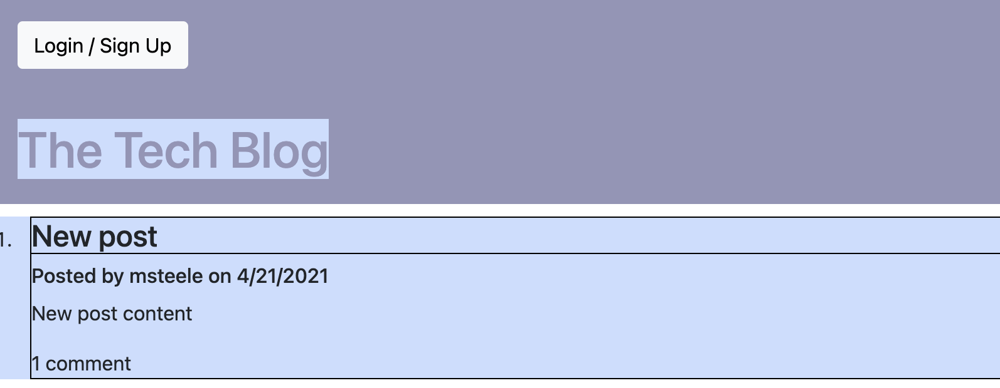
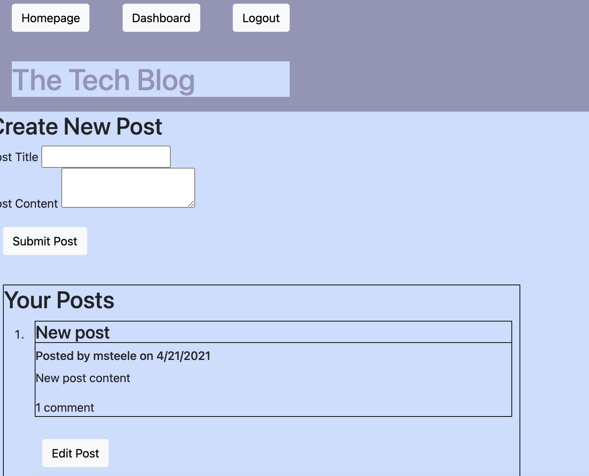
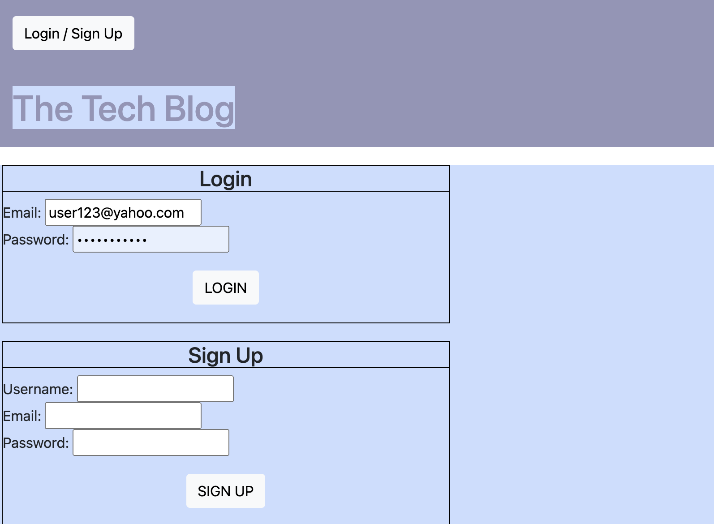

# Tech Blog

## Summary

- CMS-style blog site similar to a Wordpress site, where developers can publish their blog posts and comment on other developers’ posts as well

- Follows the MVC paradigm in its architectural structure, using Handlebars.js as the templating language, Sequelize as the ORM, and the express-session npm package for authentication.

## Live Application

[See Deployed Application]((https://tech-123-blog.herokuapp.com/))

## Example

### Homepage

### Dashboard

### Log In / Sign Up Page

